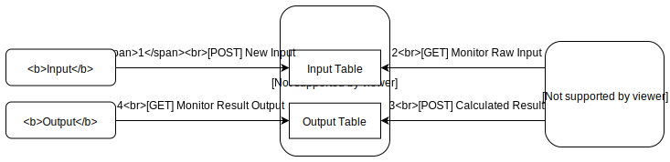

# New CityIO_AI Design & Data Format
07/05/2018&emsp;&emsp;'Ryan' Yan Zhang, Yifan Meng

Current version: 1.0 (07/05/2018)
<br><br>
## 1. Background
 The long term plan for CityMatrix is to have a modularized design which separates the whole project into four different modules: input, output, data processing, and data storage. To achieve reliability, performance, and modularity of CityMatrix, we redesigned CityMatrix_AI to adapt the overall roadmap. 
<br><br>
## 2. Structure
CityIO_AI will take over all the data processing jobs in the CityMatrix ecosystem. <br><br>

>1. **Input Module** will only gather raw input data and store it into the *Input Table* of **CityIO**<br>
>2. **CityIO_AI** monitors the *Input Table* of CityIO and will start the computing process whenever it gets new data from *Input Table*<br>
>3. When calculation is done, **CityIO_AI** puts the result into the *Output Table* of **CityIO**
>4. **Output Module** monitors the *Output Table* of **CityIO** to display the latest calculation result

Each module is highly specialized and optimized to do its own job. This design allows minimal data transmission in small packets to achieve low latency and smooth visualization
<br><br>
## 3. Input data format
Below are the definitions of keys crucial to the input JSON; For those keys not defined in this list, check [**Section 5**](#5.-CityIO-Minimal-JSON-Format) for default CityIO format. 

+ meta
+ header
    + block: `array` of `string`s, define the data contained in each grid <a id="header_block"></a>
        + Current version contains 2 values: `"block":["type", "rot"]`
    + mapping: `object` of `object`s, mapping of the values of each data defined in the `block` array
        + type: each optical tag can be decoded into an `int` value; this object explains type of the cell each value stands for
        + rot: rotation of each brick is stored as an `unsigned int` value; value stands for <u>counterclockwise rotation in degree</u> <a id="rot_mapping"></a>
        + Current version contains 2 objects: `"mapping":{"type":{"0":"RL",...},"rot":{"0":0,...}}` (see [Sample JSON](#sample_json_input) for detail)
+ grid: `array` of `object`s, each object has the keys defined in the [block](#header_block) array
+ objects
    + AIWeights: an object includes all the urban performances, values are `float` values between `0.0` and `1.0`
    + dockID: an `int` value, indicates the optical tag ID of the current dock block
    + dockRot: an `unsigned int` value between `0` and `3`, indicates the counterclockwise rotation of the dock block (rotation mapping defined [here](#rot_mapping))
    + density: a `float` value between `0.0` and `1.0`, indicates the input value from density slider
    + heatmap: a `float` value between `0.0` and `1.0`, indicates the input value from heatmap slider
    + toggle: a `bool` value, indicates the status of the toggle slider

Sample JSON: <a id="sample_json_input"></a>
<br>
&emsp;*Minimal requirement of data format V1.0*
```json
{
    "meta":{...},
    "header":{
        "name":...,
        "spatial":{...},
        "owner":{...},
        "block":["type", "rot"],
        "mapping":{
            "type":{
                "-1":"EMPTY",
                "0":"RL",
                "1":"RM",
                "2":"RS",
                "3":"OL",
                "4":"OM",
                "5":"OS",
                "6":"ROAD",
                "7":"PARK"
            },
            "rot":{
                "0":0,
                "1":90,
                "2":180,
                "3":270,
            }
        }
    },
    "grid":[
        {"type": -1, "rot":0},
        {"type": -1, "rot":0},
        ...
    ],
    "objects":{
        "AIWeights":{
            "Density":0.0,
            "Diversity":0.0,
            "Energy":0.0,
            "Traffic":0.0,
            "Solar":0.0
        },
        "dockID":0,
        "dockRot":0,
        "heatmap":0.0,
        "density":0.0,
        "toggle":false
    }
}
```
<br><br>
## 4. Output data format
Below are the definitions of keys crucial to the output JSON; For those keys not defined in this list, check [**Section 5**](#5.-CityIO-Minimal-JSON-Format) for default CityIO format. 


Sample JSON: <a id="sample_json_output"></a>
<br>
&emsp;*Minimal requirement of data format V1.0*
```json

```
<br><br>
## 5. CityIO Minimal JSON Format:
If an empty JSON is received by **CityIO**, it will be auto-completed and stored into *Input Table* as follow: 
``` json
{
    "meta":{
        "id": "",
        "timestamp": 1530306513043,  //Server timestamp
        "apiv": ""
    },
    "header":{
        "name":"",
        "spatial":{
            "nrows":0,
            "ncols":0,
            "physical_longitude":0,
            "physical_latitude":0,
            "longitude":0,
            "latitude":0,
            "cellSize":0,
            "rotation":0
        },
        "owner":{
            "name":"",
            "title":"",
            "institute":""
        },
        "block":null,
        "mapping":null
    },
    "grid":null,
    "objects":null
}
```
